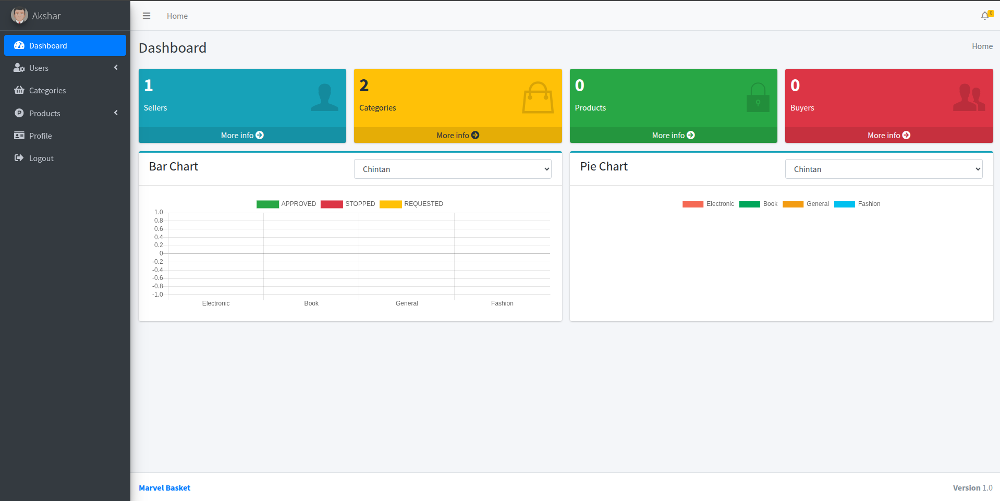

# MarvelBasketAdmin

MarvelBasketAdmin is the **Admin Panel module** of the **Marvel Basket** project — a web-based system designed to manage users, sellers, and marketplace operations efficiently.  
This module helps administrators handle user accounts, verify sellers, moderate products, and track orders from a single dashboard.

---

### Overview

The Admin Panel serves as the control center for Marvel Basket.  
It provides an interface to:

- Manage user and seller accounts
- View and monitor activities, orders, and products
- Handle notifications and system alerts
- Maintain overall platform stability

---

### Tech Stack

- **Spring Boot** — RESTful API development
- **Java (JDK 8+)** — Core programming language
- **MySQL** — Database for storing users, sellers, and product details
- **Hibernate / JPA** — ORM for database operations
- **Maven** — Build and dependency management tool
- **Apache Tomcat** — Embedded application server
- **SendGrid** — Email notification service *(credentials excluded for security)*
- **Frontend:** JSP, HTML, CSS, JavaScript, Bootstrap

---

### Features

- Admin dashboard for managing users and sellers
- CRUD operations for user and product management
- Real-time notifications and system updates
- **Notification tab implemented using TreeSet for reverse sorting** — ensures latest notifications appear first
- Email alert system using SendGrid API
- Authentication and session-based access
- Clean and responsive interface built with Bootstrap and JavaScript

---

#### Dashboard

#### Notifications Tab

---
---

### Other Modules of the Project

> **(1) Marvel Basket** — Android Application  
> • Reminds users about special events of their close ones  
> • Allows sending gifts directly through the app  
> • *Tech Stack:* Java, Firebase

> **(2) Marvel Basket Seller** — Android Application  
> • Enables gift vendors to list and manage their products  
> • Provides seller-side access to track and update inventory  
> • *Tech Stack:* Java, Firebase

---

